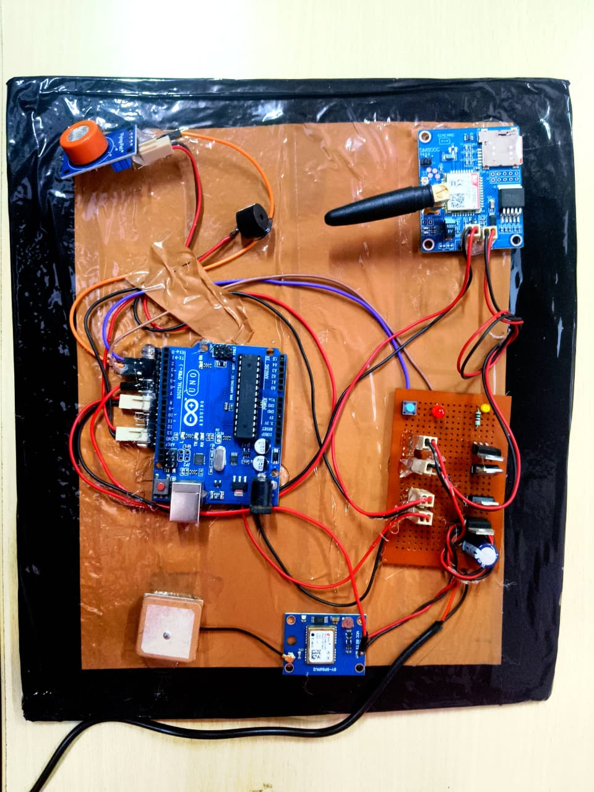
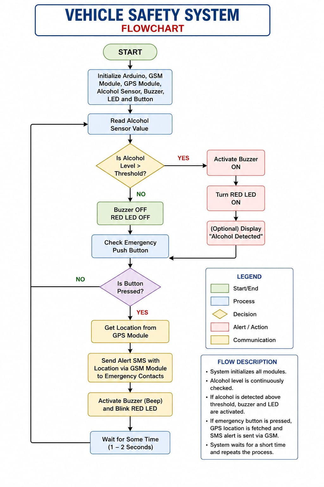

# Smart Vehicle Safety & Alert System

A low-cost vehicle safety and emergency alert system designed to improve driver and passenger safety using Arduino, GPS, GSM, alcohol detection, and an SOS alert mechanism.

## 📌 Project Overview

The Smart Vehicle Safety & Alert System is an academic IoT-based safety project developed to provide emergency assistance and vehicle safety features.

The system uses an Arduino UNO as the main controller and integrates GPS and GSM modules to detect emergency situations, obtain the vehicle's location, and send an SMS alert containing a location link.

The project also includes alcohol detection and an SOS push button for initiating emergency alerts.

## 🎯 Objectives

- Improve vehicle and personal safety using an embedded system.
- Detect alcohol presence and provide a warning.
- Obtain the vehicle's geographical location using GPS.
- Send emergency SMS alerts using GSM.
- Provide an SOS mechanism for emergency situations.
- Share a Google Maps location link with the emergency contact.
- Develop a low-cost safety solution that does not depend on a smartphone or internet connection for the core alert system.

## ⚙️ Key Features

- 🚗 Vehicle safety monitoring
- 📍 GPS-based location tracking
- 📱 GSM-based emergency SMS
- 🍺 Alcohol detection
- 🆘 SOS push-button alert
- 🔊 Buzzer warning
- 🔴 LED warning indication
- 🗺️ Google Maps location sharing
- 🔌 Arduino-based control
- 📡 Standalone emergency alert capability

## 🔧 Hardware Components

- Arduino UNO
- NEO-6M GPS Module
- SIM800L / SIM900 GSM Module
- Alcohol Sensor
- SOS Push Button
- Buzzer
- Red LED
- Connecting wires and supporting hardware

## 🔄 System Working

1. The Arduino UNO acts as the central controller.
2. The alcohol sensor monitors for the presence of alcohol.
3. When an unsafe alcohol condition is detected, the system provides a warning.
4. The GPS module obtains the vehicle's geographical coordinates.
5. In an emergency, the SOS button can be pressed to initiate an alert.
6. The GSM module sends an emergency SMS to the configured contact.
7. The SMS contains the vehicle's location in the form of a Google Maps link.
8. The buzzer and LED provide local warning indications.

## 🧩 System Architecture

**Sensors & Inputs**
- Alcohol Sensor
- SOS Push Button
- GPS Module

⬇️

**Processing**
- Arduino UNO

⬇️

**Outputs & Communication**
- Buzzer
- Red LED
- GSM Module
- Emergency SMS with GPS Location

## 🌟 Applications

- Vehicle emergency assistance
- Driver safety monitoring
- Alcohol-related safety monitoring
- Personal emergency alert systems
- Low-cost vehicle safety solutions

## 📚 Project Documentation

The repository contains the project documentation and presentation materials:

- `SVS Abstract rtp.pdf` — Project abstract
- `svs documentation.pdf` — Detailed project documentation
- `svs ppt.pptx.doc` — Project presentation

## 📷 Project Showcase

### Hardware Prototype

### System Design

### System Flow

## 👥 Team

- Ch. Surya Prashanthi
- P. Kushal Babu
- S. Siri
- M. Akshath Sai

**Project Guide:** Mr. Srinu Naik, Assistant Professor

**Department:** Computer Science and Engineering (AI & ML)

**Institution:** Vidya Jyothi Institute of Technology

**Academic Year:** 2025–2026

## 🛠️ Technologies

- Arduino
- Embedded Systems
- GPS
- GSM
- IoT
- Sensor-based Monitoring
- Emergency Alert System

## 📄 License

This project is licensed under the MIT License.
